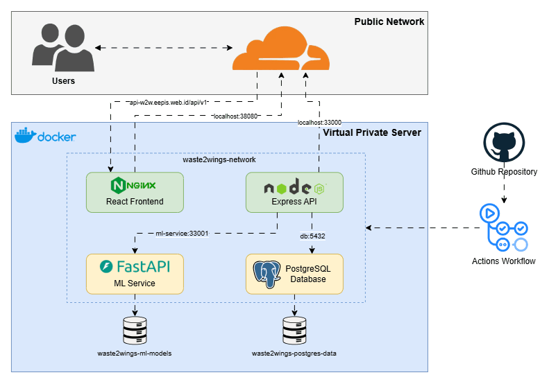

# Waste2Wings
Waste2Wings adalah platform pengelolaan rantai pasok minyak jelantah yang menghubungkan komunitas, pengepul, dan stakeholder. Sistem mencakup pencatatan setoran, validasi dan pengelompokan batch, pengujian laboratorium, pemantauan distribusi, audit aktivitas, prediksi dana, serta rekomendasi lokasi pengepul berbasis machine learning.

Project ini menggunakan struktur monorepo. Frontend, backend, ML service, dan PostgreSQL dijalankan sebagai satu stack menggunakan Docker Compose.

## Fitur Utama

- Autentikasi dan otorisasi berbasis peran: `COMMUNITY`, `COLLECTOR`, dan `STAKEHOLDER`.
- Pengajuan dan pelacakan setoran minyak jelantah oleh komunitas.
- Validasi volume, sedimen, harga, dan pembayaran oleh pengepul.
- Penggabungan setoran menjadi batch untuk diajukan kepada stakeholder.
- Pencatatan hasil laboratorium, grade, dan keputusan akhir batch.
- Dashboard, histori transaksi, peta distribusi, dan audit log.
- Prediksi kebutuhan dana menggunakan model regresi dan time-series sederhana.
- Clustering lokasi dan rekomendasi area pengepul menggunakan K-Means.

## Teknologi

| Komponen | Teknologi |
| --- | --- |
| Frontend | React 19, Vite, Tailwind CSS, Axios, React Router, Leaflet, Recharts |
| Backend | Node.js 22, Express, Prisma ORM, JWT, Swagger |
| ML service | Python 3.11, FastAPI, pandas, NumPy, scikit-learn |
| Database | PostgreSQL 16 |
| Deployment | Docker, Docker Compose, Nginx, GitHub Actions, CloudFlare |

## Struktur Repository

```text
Waste2Wings/
|-- backend/                 # REST API, Prisma schema, migration, dan seed
|-- frontend/                # React SPA 
|-- ml/                      # FastAPI, training, inference, data, dan test ML
|-- .github/workflows/       # CI dan deployment production
|-- .env.example             # Template seluruh environment variable
|-- docker-compose.yml       # Orchestration
`-- README.md
```

## Architecture



Untuk pengembangan tanpa container, gunakan Node.js 22, npm, Python 3.11, dan PostgreSQL.

## Get Started

1. Clone repository dan masuk ke direktori project.

```bash
git clone https://github.com/mcDJIL/Waste2Wings
cd Waste2Wings
```

2. Buat `.env` di root repository.

```bash
cp .env.example .env
```

3. Ganti minimal `POSTGRES_PASSWORD`, `DATABASE_URL`, dan `JWT_SECRET` dengan nilai yang aman. Password pada `POSTGRES_PASSWORD` harus sama dengan password di `DATABASE_URL`.

4. Validasi konfigurasi lalu jalankan seluruh stack.

```bash
docker compose --env-file .env config --quiet
docker compose --env-file .env up -d --build
```

5. Periksa status service.

```bash
docker compose ps
```

6. Buka frontend di `http://localhost:38080`.

Backend otomatis menjalankan `prisma migrate deploy` sebelum API dimulai. Anda dapat menjalankan seeder bila perlu.

## Environment Variables

Seluruh aplikasi menggunakan `.env` di root repository. Jangan membuat atau mengandalkan `.env` terpisah di `frontend/`, `backend/`, atau `ml/`.

| Variable | Digunakan oleh | Keterangan |
| --- | --- | --- |
| `NODE_ENV` | Backend | Mode runtime Node.js, gunakan `production` pada deployment. |
| `PORT` | Backend | Port internal API, default project `33000`. |
| `POSTGRES_DB` | PostgreSQL | Nama database. |
| `POSTGRES_USER` | PostgreSQL | User database. |
| `POSTGRES_PASSWORD` | PostgreSQL | Password database; wajib diganti. |
| `POSTGRES_PORT` | Docker Compose | Port PostgreSQL pada host, default `35432`. |
| `DATABASE_URL` | Backend/Prisma | URL koneksi dari container backend ke `db:5432`. |
| `JWT_SECRET` | Backend | Kunci penandatanganan JWT; wajib berupa nilai acak yang kuat. |
| `JWT_EXPIRES_IN` | Backend | Masa berlaku token, misalnya `1d`. |
| `CORS_ORIGIN` | Backend | Origin frontend yang diizinkan oleh CORS. |
| `ML_SERVICE_BASE_URL` | Backend | URL internal ML service, yaitu `http://ml-service:33001`. |
| `VITE_API_URL` | Frontend | URL API yang ditanam saat frontend dibuild. |
| `APP_PORT` | Docker Compose | Port frontend pada host, default `38080`. |
| `API_PORT` | Docker Compose | Port backend pada host, default `33000`. |
| `ML_PORT` | Docker Compose | Port ML service pada host, default `33001`. |
| `OMP_NUM_THREADS` | ML service | Jumlah thread OpenMP untuk proses numerik. |

Contoh development lokal tersedia di `.env.example`. Untuk production, gunakan domain HTTPS pada `CORS_ORIGIN` dan `VITE_API_URL`, misalnya:

```env
CORS_ORIGIN=https://waste2wings.example
VITE_API_URL=https://api.waste2wings.example/api/v1
```

## Endpoint dan Dokumentasi

Setelah stack berjalan:

- Frontend: `http://localhost:38080`
- Backend health check: `http://localhost:33000/api/v1/health`
- Backend Swagger UI: `http://localhost:33000/api-docs`
- ML health check: `http://localhost:33001/health`
- ML Swagger UI: `http://localhost:33001/docs`
- ML ReDoc: `http://localhost:33001/redoc`

## Database dan Seed

Migration production dijalankan otomatis oleh container backend. Untuk menjalankannya manual:

```bash
docker compose exec api npx prisma migrate deploy
```

Menjalankan seed data demo:

```bash
docker compose exec api npm run prisma:seed
```

Seed membuat akun demo dengan domain `@w2w.test` dan password `password123`. Data ini hanya untuk development atau demonstrasi dan tidak boleh digunakan sebagai kredensial production.

## Development

### Frontend

Frontend membaca variable Vite dari `.env` root melalui `envDir`.

```bash
cd frontend
npm ci
npm run dev
```

Perintah validasi:

```bash
npm run lint
npm run build
```

### Backend

Backend membaca `.env` root ketika dijalankan melalui `src/server.js`.

```bash
cd backend
npm ci
npx prisma generate
npm run dev
```

Jika backend dijalankan di host sementara PostgreSQL berjalan di Docker, ubah host dan port `DATABASE_URL` lokal menjadi `localhost:35432`. Nilai `db:5432` hanya dapat diakses dari network Docker.

### ML Service

```bash
cd ml
python -m venv .venv
```

Aktifkan virtual environment, lalu jalankan:

```bash
pip install -r requirements.txt
python -m uvicorn src.api:app --reload --host 0.0.0.0 --port 33001
```

Menjalankan test ML:

```bash
pytest
```

## Deployment Production

Workflow `.github/workflows/deploy-production.yml` berjalan ketika ada push ke `main` atau ketika dijalankan manual. Workflow memvalidasi dan membangun backend, frontend, serta ML service sebelum melakukan deployment melalui SSH.

Repository secrets yang wajib tersedia di GitHub Actions:

| Secret | Keterangan |
| --- | --- |
| `VPS_HOST` | IP atau hostname server. |
| `VPS_USER` | User SSH yang dapat menjalankan Docker tanpa `sudo`. |
| `VPS_PASSWORD` | Password SSH. |
| `VPS_PORT` | `22` | Port SSH. |
| `VPS_APP_DIR` | `/home/developer/waste2wings` | Lokasi clone repository di server. |

File `.env` production harus sudah tersedia di `VPS_APP_DIR`. Workflow tidak mengunggah, membuat, atau mengganti file tersebut;

```
⠀⠀⠀⠀⠀⠀⠀⠀⠀⠀⠀⠀⠀⢰⣾⣿⣿⣿⣷⣆⠀⠀⠀⠀⠀⠀⠀⠀⠀⠀⠀⠀⠀
⠀⠀⠀⠀⠀⠀⠀⠀⣀⣤⣶⣶⣶⣾⣝⣛⣛⣛⣿⣷⣶⣶⣦⣤⡀⠀⠀⠀⠀⠀⠀⠀⠀
⠀⠀⠀⠀⢀⣀⣀⣾⣿⣿⣿⣿⣿⣿⡿⠿⠛⠿⢿⣿⣿⣿⣿⣿⣿⣦⢀⣀⣀⠀⠀⠀⠀
⠀⠀⣠⣾⣿⣿⣿⡟⠻⣿⣿⡿⠋⣵⠚⠉⠉⠉⠓⢮⣙⡛⠿⢿⣿⡻⠋⠀⠈⠑⠦⡀⠀
⢠⣾⣿⣿⣿⣿⣿⠇⠀⣾⣿⣇⠸⡀⠀⠀⠀⠀⠀⠀⣀⣈⣤⣍⣁⡀⠀⠀⠀⠀⠀⠸⢆
⣾⣿⣿⣿⣿⣿⢏⣴⣾⣿⣿⣿⣿⣟⠒⠤⠤⢤⠶⣻⣿⣿⣿⣷⣶⣌⡓⢄⠀⠀⠀⠀⢸
⠻⢿⡿⠿⠛⣵⣿⣿⣿⣿⣿⣿⣿⣿⣶⣦⣤⣴⣾⣿⣿⣿⣿⣿⣿⣿⣷⣄⠑⠠⢄⣠⡼
⠀⠀⠀⠀⢸⣿⣿⣿⣿⣿⣿⣿⡿⠿⠛⣛⣉⣛⠻⠿⣿⣿⣿⣿⣿⣿⣿⣿⡆⠀⠀⠀⠀
⠀⠀⠀⠀⠀⠻⢿⣿⣿⣿⠿⠋⢀⣴⣿⣿⣿⣿⣿⣦⡈⠻⢿⣿⣿⣿⣿⡿⠁⠀⠀⠀⠀
⠀⠀⠀⠀⠀⠀⠀⠀⠀⠀⠀⢀⣿⣿⣿⣿⣿⣿⣿⣿⣿⡀⠀⠈⠉⠉⠁⠀⠀⠀⠀⠀⠀
⠀⠀⠀⠀⠀⠀⠀⠀⠀⠀⠀⠸⣿⣿⣿⣿⣿⣿⣿⣿⣿⠇⠀⠀⠀⠀⠀⠀⠀⠀⠀⠀⠀
⠀⠀⠀⠀⠀⠀⠀⠀⠀⠀⠀⠀⠻⣿⣿⣿⣿⣿⣿⣿⠟⠀⠀⠀⠀⠀⠀⠀⠀⠀⠀⠀⠀
⠀⠀⠀⠀⠀⠀⠀⠀⠀⠀⠀⠀⠀⠈⠛⠿⠿⠿⠛⠉⠀⠀⠀⠀⠀⠀⠀⠀⠀⠀⠀⠀⠀
⠀⠀⠀⠀⠀⠀⠀⣠⣶⣶⣶⣶⣶⣤⠒⠀⠒⠒⠒⢤⣶⣶⣶⣶⣶⣴⣶⣶⣶⣶⣶⠀⠀
⠀⠀⠀⠀⠀⠀⠀⣿⣿⠉⠉⠙⣿⡏⠁⣿⣿⣛⣃⣸⣿⠋⠉⠉⣿⣿⣿⣷⣾⣷⣶⡀⠀
⠀⠀⠀⠀⠀⠀⠀⣿⣿⣷⣶⣿⣿⠧⣀⠉⣉⣉⢓⣿⣿⡀⠀⠀⣿⣿⣿⣿⣿⣿⣿⠇⠀
⠀⠀⠀⠀⠀⠀⠀⣿⣿⠁⠀⠀⠀⠀⠀⠀⠀⠀⠀⠀⠀⠀⠀⠀⠀⠀⠀⠀⠀⠀⠀⠀⠀
```